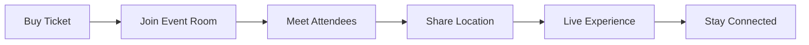

# ROVIFY MOBILE

> _Your Pocket Portal to the Event Universe_

---

## The Future Lives in Your Pocket

Events don't happen at your desk. They happen **out there**—in warehouses, parks, rooftops, underground venues, and places that only exist when the crowd gathers. That's why Rovify Mobile isn't just a companion app; it's the **command center** for your event life.

```
Desktop Discovery → Travel Mode → Venue Arrival → LIVE EXPERIENCE
```

We built Rovify Mobile because the magic happens when you're **moving**, **connecting**, and **experiencing** in real-time.

---

## ECHO: Where Events Come Alive

### The Game Changer

**Echo** isn't just messaging—it's the nervous system of every event. Powered by **XMTP**, it creates living, breathing communities around every experience.

| **Before**               | **During**                 | **After**                |
| :----------------------- | :------------------------- | :----------------------- |
| _"Who's going to this?"_ | _"Where's the best spot?"_ | _"That was incredible!"_ |
| Pre-event coordination   | Real-time venue updates    | Memory sharing           |
| Outfit planning          | Safety check-ins           | Planning the next one    |
| Meeting new people       | Finding your crew          | Staying connected        |

### The Echo Effect



Every ticket is a **conversation starter**. Every event is a **community**. Every experience becomes a **lasting connection**.

---

## The World is Your Venue

### Discovery That Moves With You

Traditional event apps show you what's happening. Rovify Mobile shows you **where life is happening**.

```
Open App → See Nearby Events → Check Who's Going → Start Chatting
```

Our **live map** isn't just dots on a screen—it's a **heartbeat** of your city's energy:

- **Heat zones** showing event density
- **Friend tracking** (with permission) to see where your crew is
- **Real-time capacity** updates so you know if that underground show is packed
- **Story pins** from attendees sharing live moments

---

## The Stream Never Stops

### From FOMO to JOMO

Can't make it to that festival? Your friends are there and **streaming live**. See multiple perspectives of the same moment. Feel the bass drop from thousand miles away.

**Features that blur distance:**

- **Multi-angle streaming** from different attendees
- **Synchronized audio** streams
- **Virtual attendance** with chat participation
- **Digital souvenirs** from events you couldn't physically attend

---

## Your Digital Memory Box

### More Than Tickets—They're Time Capsules

Every Rovify experience becomes part of your **digital story**:

| **Ticket NFTs**       | **Moment Cards**        | **Achievement Badges** |
| :-------------------- | :---------------------- | :--------------------- |
| Proof you were there  | Photos with geo-stamps  | "First to arrive"      |
| Access to alumni chat | Video highlights        | "Met 10 new people"    |
| Future event perks    | Collaborative playlists | "Danced until 3am"     |

These aren't just **collectibles**—they're **conversation starters** for years to come.

---

## The Vision

### Events as Living Ecosystems

We're not building another social app. We're creating **digital campfires** where stories begin, connections deepen, and memories become **tangible**.

```
Physical Event + Digital Community + Global Reach = Rovify Magic
```

Every festival becomes a **mini-society**. Every concert becomes a **shared heartbeat**. Every gathering becomes a **digital neighborhood** that never really ends.

---

## Why Mobile-First?

### Because Life is Mobile

Events don't wait for you to get home and check your laptop. They happen **now**:

- **Split-second decisions**: "Should I go to this show tonight?"
- **Real-time coordination**: "Meet me by the main stage"
- **Instant sharing**: Capture and share moments as they happen
- **Location awareness**: The app knows where you are and what's nearby
- **Always connected**: Your event communities travel with you

---

## The Ripple Effect

When you join Rovify Mobile, you're not just getting an app—you're joining a **movement**:

### For Event Goers

- **Never attend alone** again—find your tribe before you arrive
- **Discover hidden gems** through community recommendations
- **Collect memories** that last forever
- **Stay connected** with people who share your passions

### For Creators

- **Build communities**, not just audiences
- **Engage before, during, and after** every event
- **Create digital experiences** that extend far beyond the venue
- **Understand your audience** through real participation data

### For the World

- **Reduce event anxiety** through community support
- **Increase event attendance** through social proof
- **Create lasting connections** across geographical boundaries
- **Preserve cultural moments** for future generations

---

> _"Rovify Mobile transforms every event from a moment in time into a lifetime connection."_
>
> _— Where digital meets physical, where strangers become friends, where experiences become eternal_

---

## The Experience Layers

```
INTERFACE LAYER    → Beautiful, intuitive design
SOCIAL LAYER       → Echo messaging & communities
OWNERSHIP LAYER    → NFT tickets & digital assets
DISCOVERY LAYER    → Maps, recommendations, serendipity
CONNECTION LAYER   → XMTP, Web3, decentralized identity
```

---

## Technical Foundation

Built with **React Native** and **TypeScript** for cross-platform excellence. **XMTP** powers our decentralized messaging infrastructure, while **Ethereum** and **Base** networks handle our NFT ticketing system.

The app leverages **real-time APIs**, **geolocation services**, and **WebRTC** for streaming capabilities—all wrapped in an interface designed for **speed**, **reliability**, and **delight**.

---

_The best events happen when strangers become friends. Rovify Mobile makes that magic **scalable**._

<!-- **Download. Discover. Connect. Experience.** -->

<!--
[App Store](#) • [Google Play](#) • [Join the Community](https://discord.gg/rovify) -->
